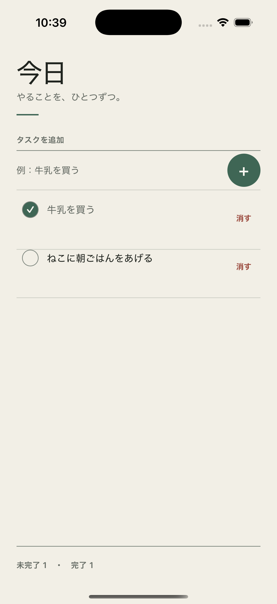
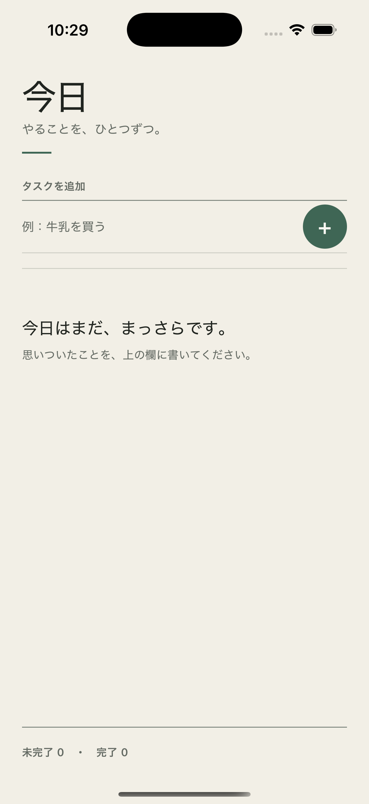

# Todo for Whisker

Rust 製のネイティブモバイルアプリフレームワーク [Whisker](https://whisker.rs/) で作った Todo アプリです。

状態管理、コンポーネント、入力、端末内保存を小さなアプリにまとめた公開用のコード例です。

<p align="center">
  
  
</p>

## できること

- タスクの追加（前後の空白を除去、空文字は追加しない）
- 完了／未完了の切り替え
- タスクの削除
- 未完了・完了件数の表示
- `whisker-local-store` による端末内の永続化
- 壊れた保存データを上書きしない復旧導線
- Safe Area とアクセシビリティ属性に対応した UI

## 実装のポイント

- `signal` と `computed` を使い、入力値と Todo 一覧をリアクティブに更新する
- 保存に成功してから画面の状態を更新し、保存に失敗した変更を UI に残さない
- `ForEach` のキーに Todo ID を使い、行ごとの状態を再取得する
- JSON の変換と端末内保存を画面から分離し、ドメインロジックを単体テストする

## 構成

```text
src/
├── app.rs                 # 状態、保存、画面操作
├── components/
│   ├── screen.rs          # 画面と入力フォーム
│   └── todo_row.rs        # Todo 行
├── model.rs               # Todo ドメイン
├── repository.rs          # JSON codec と local-store
└── theme.rs               # デザイントークン
```

## 確認環境

- macOS 26.5.2
- Rust 1.92.0
- Whisker 0.10.1
- Xcode 26.6
- iOS Simulator 26.5

## iOS Simulator で動かす

Whisker CLI と iOS Simulator 用の Rust target を用意します。

```sh
cargo install whisker-cli --version 0.10.1 --locked
rustup target add aarch64-apple-ios-sim x86_64-apple-ios
whisker doctor --no-android
```

```sh
whisker run ios
```

Android で動かす場合は Android Studio、Android SDK、JDK と Android 用の Rust target が必要です。

## 検証

```sh
whisker fmt --check src/*.rs src/components/*.rs
cargo check --workspace --all-targets
cargo check --target aarch64-apple-ios-sim
cargo check --target x86_64-apple-ios
cargo test --workspace --all-targets
cargo clippy --workspace --all-targets -- -D warnings
```
